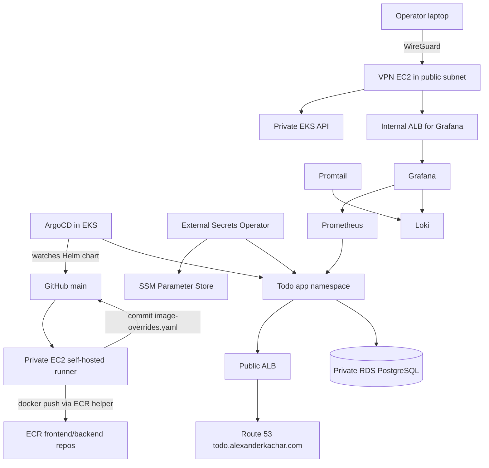

# Project Foxtrot EKS Pipeline

Production-grade DevOps infrastructure for a deliberately small full-stack Todo app. The app is simple React + Express + PostgreSQL CRUD; the real focus is AWS EKS, GitOps deployment, private cluster access, secrets management, observability, network isolation, and a self-hosted CI runner.

Live target: `https://todo.alexanderkachar.com`

## Architecture



The VPC has two public subnets for the internet-facing ALB and VPN, two private subnets for EKS nodes and the EC2 runner, and two database subnets for RDS. A single NAT gateway is used for private egress, with VPC endpoints for ECR, S3, EKS, EC2, STS, SSM, SSM Messages, EC2 Messages, and CloudWatch Logs.

## Repository Structure

`.github/workflows/ci.yml` builds frontend and backend images on the self-hosted runner, pushes to ECR, and updates `k8s/helm/todo-app/image-overrides.yaml`.

`app/backend/` contains the Express API, PostgreSQL access, Prometheus metrics, Dockerfile, and `init.sql`.

`app/frontend/` contains the React + Vite UI, Nginx configs, and Dockerfile.

`k8s/helm/todo-app/` contains the application Helm chart, public and internal ALB ingresses, ExternalSecret, ServiceMonitor, PrometheusRule, and Grafana dashboard.

`terraform/` contains reusable AWS modules and the `environments/dev` composition for VPC, EKS, RDS, ECR, Route 53, runner, VPN, and Helm add-ons.

`docker-compose.yml` runs local PostgreSQL, backend, and frontend.

`destroy.sh` removes controller-owned ALBs before running `terraform destroy`.

## Prerequisites

Before the first apply, create or verify:

- AWS region `us-east-1`
- ACM wildcard certificate for `*.alexanderkachar.com` in `us-east-1`
- Route 53 hosted zone for `alexanderkachar.com`
- S3 state bucket and DynamoDB lock table matching `terraform/environments/dev/backend.tf`
- GitHub repository `alexkachar/eks-pipeline-project-foxtrot`
- GitHub PAT in SSM at `runner_github_token_parameter_name`; it needs `repo` and `contents: write`
- GitHub Actions variable `AWS_ACCOUNT_ID`
- Your `developer_ip_cidr` and optional WireGuard client public key in `terraform/environments/dev/terraform.tfvars`
- Local AWS credentials, Terraform, Helm, kubectl, and AWS CLI

## Local Development

```bash
docker compose up --build
```

Frontend runs at `http://localhost`, backend at `http://localhost:3000`, and PostgreSQL at `localhost:5432`. Local backend DB SSL is disabled with `DB_SSL=false`.

## Bootstrap

1. Edit `terraform/environments/dev/backend.tf` if your Terraform state bucket/table names differ.
2. Edit `terraform/environments/dev/terraform.tfvars` with your developer IP CIDR and WireGuard client public key.
3. Run:

   ```bash
   cd terraform/environments/dev
   terraform init
   terraform apply
   ```

4. Connect to the VPN, then configure kubectl:

   ```bash
   aws eks update-kubeconfig --name project-foxtrot-dev --region us-east-1
   ```

5. Wait for the public app ALB:

   ```bash
   kubectl get ingress -n todo-app -o jsonpath='{.items[0].status.loadBalancer.ingress[0].hostname}'
   ```

6. Set that hostname as `alb_dns_name` in `terraform/environments/dev/terraform.tfvars`.
7. Run `terraform apply` again to create the Route 53 alias for `todo.alexanderkachar.com`.

After bootstrap, CI pushes new image tags into Git and ArgoCD syncs the app automatically.

## Operations

Grafana is exposed only through the internal ALB and should be reached over WireGuard. Prometheus keeps 6 hours of data; Loki runs in single-binary filesystem mode; Promtail ships pod logs into Loki.

To destroy cleanly:

```bash
./destroy.sh
```

The helper deletes the ArgoCD app and ingresses, waits for the AWS Load Balancer Controller to remove both ALBs, clears `alb_dns_name`, and then runs `terraform destroy`.
